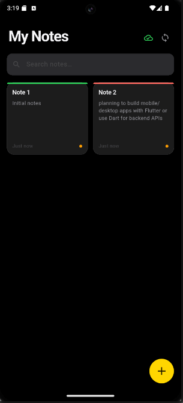
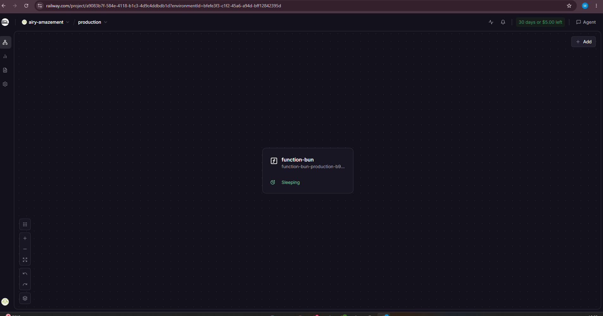

# Offline Notes

A Flutter notes app that works fully offline and synchronizes to a REST API deployed on Railway when connectivity is restored. Built with BLoC, Hive, and a Bun/Hono backend.

---

## Screenshots

### App



### Mock REST API — Deployed on Railway



> The mock REST API is built with **Bun + Hono** and deployed on [Railway](https://railway.app).
> Live URL: `https://function-bun-production-b979.up.railway.app`

---

## Features

- **Offline-first** — create, edit, and delete notes with no internet required
- **Auto-sync** — queued changes push to the server the moment connectivity returns
- **Conflict detection** — flags notes modified both locally and on the server while offline
- **Conflict resolution** — choose to keep your local version or accept the server version
- **Real-time connectivity indicator** — cloud icon reflects network state within 3 seconds
- **Sync status on every note** — green cloud (synced), orange dot (pending), red dot (conflict)
- **Search** — filter notes by title or body instantly
- **Shimmer skeleton** — smooth loading state while notes are fetched
- **Animated empty state** — Lottie animation when no notes exist
- **Dark theme** — polished dark UI with micro-animations on every card

---

## Architecture

```
lib/
├── features/notes/
│   ├── data/
│   │   ├── enum/           # SyncStatus, OperationType
│   │   ├── exceptions/     # HiveInitializationException
│   │   ├── local/          # Hive datasource implementation
│   │   ├── models/         # NoteModel, SyncOperation
│   │   ├── remote/         # HTTP datasource (Bun/Hono API)
│   │   └── repositories/   # NoteRepository contract + impl
│   ├── presentation/
│   │   ├── bloc/           # NotesBloc, events, states
│   │   └── pages/          # NotesPage, AddEditNotePage
│   └── services/
│       ├── connectivity_service.dart
│       ├── hive_service.dart
│       └── sync_service.dart
├── app_theme.dart
└── main.dart
```

**State management:** BLoC
**Local storage:** Hive (no-SQL, key-value)
**Remote storage:** Bun + Hono REST API on Railway
**Connectivity:** connectivity_plus
**Animations:** flutter_animate, Lottie, Shimmer

---

## Sync Flow

```
App starts
    │
    ├─► Load notes from Hive (instant, offline)
    │
    └─► Online?
            │
           Yes
            │
            ├─► Detect conflicts (local pending vs server updated)
            ├─► Push pending queue (create / update / delete)
            └─► Pull new notes from server
```

Notes in conflict are flagged with a red dot. Tapping them opens a resolution dialog showing both versions side by side.

---

## Sync Status Indicators

Each note card displays its current sync state:

| Indicator | Meaning |
|-----------|---------|
| 🟢 Cloud icon | Synced with server |
| 🟠 Orange dot | Pending — waiting to sync |
| 🔴 Red dot | Conflict — edited both locally and on server |

---

## Mock REST API

The backend is a minimal REST API built with **Bun v1.3 + Hono**, deployed on **Railway**.

**Live URL:** `https://function-bun-production-b979.up.railway.app`

### Routes

| Method | Path | Description | Status |
|--------|------|-------------|--------|
| `GET` | `/notes` | Fetch all notes | 200 |
| `POST` | `/notes` | Create a note | 201 |
| `PUT` | `/notes/:id` | Update a note | 200 |
| `DELETE` | `/notes/:id` | Delete a note | 200 |
| `GET` | `/api/health` | Health check | 200 |

> **Note:** The current deployment uses in-memory storage. Notes reset on server restart. Add a Railway PostgreSQL plugin for persistence.

---

## Getting Started

### Prerequisites

| Tool | Version |
|------|---------|
| Flutter | 3.19+ |
| Dart | 3.11+ |
| Android Studio / VS Code | Latest |
| Android emulator or physical device | API 21+ |

---

### Step 1 — Clone the repository

```bash
git clone <your-repo-url>
cd offline-notes/offline_notes_app
```

---

### Step 2 — Install dependencies

```bash
flutter pub get
```

---

### Step 3 — Configure the backend URL

Open `lib/features/notes/data/remote/note_remote_datasource.dart` and update:

```dart
const _baseUrl = 'https://function-bun-production-b979.up.railway.app';
```

---

### Step 4 — Run the app

```bash
flutter run
```

To target a specific device:

```bash
flutter devices          # list available devices
flutter run -d <device-id>
```

---

### Step 5 — Build a release APK

```bash
flutter build apk --release
```

Output: `build/app/outputs/flutter-apk/app-release.apk`

---

## Backend — Run Locally

```bash
bun install
bun run index.ts
```

Then update `_baseUrl` in the app to `http://localhost:3000`.

---

## Project Dependencies

| Package | Purpose |
|---------|---------|
| `flutter_bloc` | State management |
| `equatable` | Value equality for BLoC states |
| `hive` + `hive_flutter` | Local offline storage |
| `connectivity_plus` | Network state detection |
| `http` | REST API calls |
| `uuid` | Unique note IDs |
| `flutter_animate` | Card micro-animations |
| `shimmer` | Skeleton loading UI |
| `lottie` | Animated empty state |
| `logger` | Structured debug logging |
| `bloc_test` | BLoC unit testing |
| `mocktail` | Mock dependencies in tests |

---

## Troubleshooting

**App crashes immediately on Android**
- Ensure `INTERNET` and `ACCESS_NETWORK_STATE` permissions are in `AndroidManifest.xml`
- Wipe emulator data if storage is full: Android Studio → Device Manager → Wipe Data

**Gradle build fails**
- Requires AGP 9.0+ and Kotlin 2.3+
- Run `flutter clean && flutter pub get` then retry

**Sync returns 404**
- Verify the backend is deployed and `_baseUrl` matches your Railway domain
- Check Railway → Deployments to confirm the service is active

**Notes not syncing after reconnect**
- The connectivity poll runs every 3 seconds — wait briefly after toggling network
- Check flutter logs: `adb logcat -s flutter`
